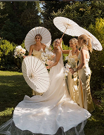
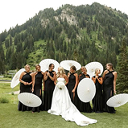
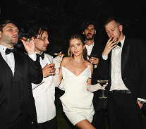

# Руководство по замене изображений

Сейчас на сайте используются SVG placeholder'ы. После экспорта реальных изображений из Figma, выполните следующие шаги:

## Шаг 1: Экспорт изображений из Figma

### Бант (bow)
1. Откройте ваш файл в Figma
2. Выберите элемент с розовым бантом
3. Export → PNG → 2x или 3x
4. Сохраните как `bow.png` в папку `assets/`

### Фото дресс-кода
1. Выберите фото-примеры для девушек
2. Export → JPG → Quality: 80-90% → 2x
3. Сохраните как:
   - `dresscode-girls-1.jpg`
   - `dresscode-girls-2.jpg`
4. Выберите фото-пример для мужчин
5. Сохраните как `dresscode-men.jpg`

## Шаг 2: Замена в HTML

Откройте `index.html` и выполните следующие замены:

### Замена бантов (4 места)

Найдите все места с:
```html

```

Замените на:
```html

```

**Где искать:** Ищите по слову "bow-placeholder" - должно быть 4 вхождения.

### Замена фото дресс-кода для девушек

Найдите:
```html


```

Замените на:
```html


```

### Замена фото дресс-кода для мужчин

Найдите:
```html

```

Замените на:
```html

```

## Шаг 3: Оптимизация изображений (рекомендуется)

Для ускорения загрузки сайта оптимизируйте изображения:

### Онлайн-инструменты:
- **TinyPNG** (https://tinypng.com/) - для PNG и JPG
- **Squoosh** (https://squoosh.app/) - от Google
- **Compressor.io** (https://compressor.io/)

### Рекомендуемые параметры:
- **JPG качество:** 80-85%
- **PNG:** используйте TinyPNG для сжатия
- **Размеры:** ширина не более 1200px (для мобильных устройств достаточно)

## Шаг 4: Проверка

1. Откройте `index.html` в браузере
2. Проверьте, что все изображения загружаются
3. Откройте консоль (F12) - не должно быть ошибок 404
4. Проверьте на мобильном устройстве

## Альтернативный способ (если не хотите редактировать HTML)

Вы можете просто назвать ваши файлы так же, как placeholders:
1. Экспортируйте бант → сохраните как `bow-placeholder.svg` (или конвертируйте PNG в SVG)
2. Экспортируйте фото → сохраните с теми же именами

Но лучше использовать правильные форматы (PNG для банта, JPG для фото).

## Troubleshooting

**Изображения не отображаются?**
- Проверьте, что файлы лежат в папке `assets/`
- Проверьте имена файлов (регистр важен!)
- Откройте консоль браузера для поиска ошибок

**Изображения слишком большие/медленно грузятся?**
- Используйте онлайн-компрессоры (см. Шаг 3)
- Уменьшите разрешение до 1200-1500px по ширине

**Изображения выглядят размыто?**
- Экспортируйте в 2x или 3x масштабе из Figma
- Используйте правильный формат (PNG для графики, JPG для фото)
